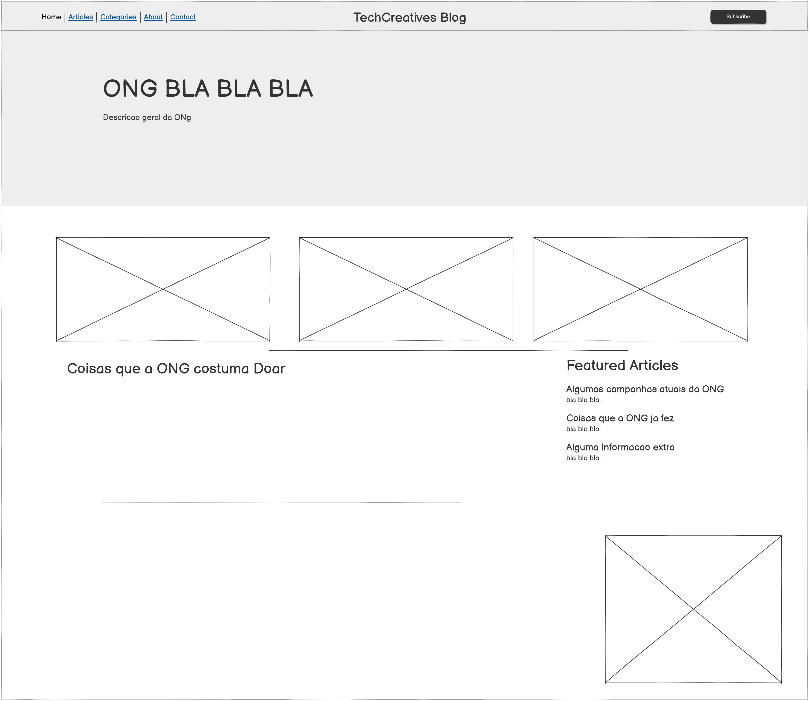
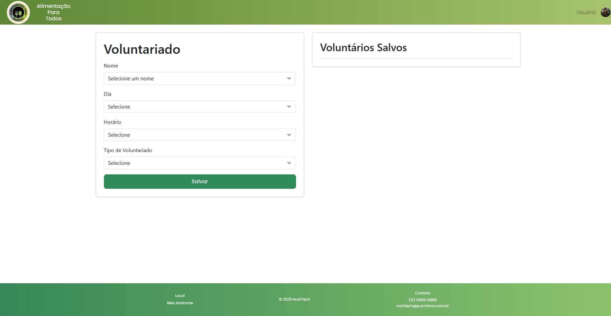

# Introdução

Informações básicas do projeto.

* **Projeto:** [Alimentação para todos]
* **Repositório GitHub:** [Repositorio](https://github.com/ICEI-PUC-Minas-PMGES-TI/pmg-es-2025-1-ti1-2401100-nutritech)
* **Membros da equipe:**

  * [Artur Neves](https://github.com/Nevez6)
  * [Arthur Vieira](https://github.com/arthurvieiralopes)
  * [Guilherme Pereira](https://github.com/GuilhermePBittencourt)
  * [Larissa Monção](https://github.com/LarissaMoncao)
  * [Matheus Figueiredo](https://github.com/matheusfigueiredo12)
  * [Lucas Duarte](https://github.com/caslulu)
  * [Raphael Thierry](https://github.com/Thierry07)

A documentação do projeto é estruturada da seguinte forma:

1. Introdução
2. Contexto
3. Product Discovery
4. Product Design
5. Metodologia
6. Solução
7. Referências Bibliográficas

✅ [Documentação de Design Thinking (MIRO)](files/design-thinking.pdf)

# Contexto

Detalhes sobre o espaço de problema, os objetivos do projeto, sua justificativa e público-alvo.

## Problema

**A insegurança alimentar afeta muitas comunidades em Belo Horizonte, e a distribuição de alimentos pelas ONGs enfrenta desafios logísticos. Além disso, a complexidade do processo de doação desmotiva muitas pessoas a contribuírem, reduzindo o alcance das iniciativas de ajuda.A insegurança alimentar presente em muitas comunidades de Belo Horizonte, a dificuldade em relação a distribuição de alimentos das ONGs e a dificuldade para realizar as Doações, que faz com que muitas pessoas desistam de ajudar o proximo.**

## Objetivos

**Objetivo Geral**: Desenvolver uma aplicação que facilite a conexão entre doadores e ONGs, tornando o processo de doação mais acessível e eficiente para reduzir a insegurança alimentar em comunidades de Belo Horizonte.

**Objetivos Específicos:**

* Criar uma funcionalidade que exiba ONGs confiáveis próximas ao doador, incentivando doações.

* Desenvolver um sistema de geolocalização que permita que pessoas em situação de vulnerabilidade encontrem facilmente ONGs próximas para buscar auxílio.

* Aumentar a quantidade de doações realizadas, contribuindo para minimizar a insegurança alimentar na região.


## Justificativa

**A insegurança alimentar é uma realidade para muitas comunidades de Belo Horizonte, e embora existam ONGs dedicadas a minimizar esse problema, as mesmas possuem problemas em relação a distribuição de alimentos. Além disso, muitas pessoas que desejam doar encontram dificuldades para localizar instituições confiáveis, o que acaba desmotivando.  \
Diante disso, este projeto busca desenvolver uma aplicação que simplifique essa conexão, permitindo que doadores encontrem ONGs próximas e que pessoas em situação de vulnerabilidade localizem pontos de apoio. Utilizando geolocalização e dados reais, a proposta visa tornar o processo mais acessível, eficiente e com maior impacto na luta contra a fome.**

## Público-Alvo

 **O Publico-Alvo da aplicação são:**  
 * **Doadores:** Pessoas que desejam contribuir com doações de alimentos, mas enfrentam dificuldades no processo, seja por falta de tempo, desconhecimento sobre ONGs confiáveis ou insegurança quanto ao impacto de suas doações.
 * **ONGs:** ONGs que buscam otimizar a captação de doações, ampliar seu alcance e melhorar a logística da distribuição de alimentos para atender mais pessoas em situação de vulnerabilidade.
 * **Necessitados:** Pessoas que necessitam de doações de alimentos e precisam de uma maneira mais acessível e rápida de encontrar ONGs próximas que possam oferecer assistência.

# Product Discovery

## Etapa de Entendimento

****
****


## Etapa de Definição

### Personas

****

# Product Design

Nesse momento, vamos transformar os insights e validações obtidos em soluções tangíveis e utilizáveis. Essa fase envolve a definição de uma proposta de valor, detalhando a prioridade de cada ideia e a consequente criação de wireframes, mockups e protótipos de alta fidelidade, que detalham a interface e a experiência do usuário.

## Histórias de Usuários

Com base na análise das personas foram identificadas as seguintes histórias de usuários:

****


## Proposta de Valor

****


## Requisitos

As tabelas que se seguem apresentam os requisitos funcionais e não funcionais que detalham o escopo do projeto.

### Requisitos Funcionais

| ID      | Requisitos Funcionais                                | Prioridade |
|---------|------------------------------------------------------|------------|
| RF-001  | O sistema deve cadastrar os Doadores               | Alta       |
| RF-002  | O sistema deve cadastrar as Ongs                   | Alta       |
| RF-003  | O sistema deve ter um Feed para a Ong              | Média      |
| RF-004  | O sistema deve permitir filtrar pesquisas          | Média      |
| RF-005  | O Sistema deve ter um mapa com as Ongs de BH       | Alta       |
| RF-006  | Deve ter um sistema de Avaliação de ONGs           | Média      |
| RF-007  | Deve ter uma opção de receber emails               | Baixa      |
| RF-008  | O sistema deve cadastrar as Pessoas Necessitadas   | Baixa      |
| RF-009  | O sistema tem que ter uma opção de Doação Recorrente | Baixa   |
| RF-010  | O sistema deve ter Dashboard para ONGs             | Baixa      |
| RF-011  | O sistema deve ter um ranking de doações             | Baixa      |
| RF-012  | O sistema deve utilizar APIs        | Media     |


### Requisitos não Funcionais

| ID      | Requisitos Não Funcionais                                          | Prioridade |
|---------|--------------------------------------------------------------------|------------|
| RNF-001 | O Layout do sistema deve ser responsivo, principalmente para mobile | Alta       |
| RNF-002 | O sistema deve processar Requests de maneira rápida               | Média      |
| RNF-003 | O sistema tem que garantir a segurança de dados dos usuários      | Alta       |
| RNF-004 | O sistema tem que ser fácil de escalar                            | Média      |
| RNF-005 | O sistema tem que ter uma interface fácil de compreender          | Alta       |

### Restrições do Projeto  

| ID    | Restrições do Projeto                                      | Categoria    |
|-------|------------------------------------------------------------|-------------|
| R-001 | O processo deve utilizar HTML, CSS, JavaScript para desenvolvimento | Linguagens  |
| R-002 | O sistema deve utilizar Heroku como ambiente              | Ambiente    |

## Projeto de Interface

Artefatos relacionados com a interface e a interacão do usuário na proposta de solução.

### Wireframes

Estes são os protótipos de telas do sistema.

##### TELA INICIAL

A tela que aparece assim que o usuario entra no sistema


##### Tela Cadastro

A tela para o usuario realizar o cadastro


##### Tela Login

A tela para o usuario realizar o login


##### Tela da ONG

A tela que contem algumas informações da ONG para o Doador/Necessitado



##### Tela do Dashboard da ONG

A tela que contem algumas informações da ONG para o funcionario da ONG


##### Tela da Doação

A tela para realizar a doação, contendo opções do que doar


##### Tela para Doação Pix

A tela que contem as informações necessarias para realizar a doação por pix


### User Flow


### Protótipo Interativo


[Protótipo Interativo (MarvelApp)](https://marvelapp.com/prototype/adb7bg6/screen/96997443)

# Metodologia

Detalhes sobre a organização do grupo e o ferramental empregado.

## Ferramentas

Relação de ferramentas empregadas pelo grupo durante o projeto.

| Ambiente                    | Plataforma | Link de acesso                                     |      Motivo                                          
| --------------------------- | ---------- | -------------------------------------------------- | ------------------------------------------------------------------------|
| Processo de Design Thinking | Miro       | [Miro](https://miro.com/app/board/uXjVIaSTdXg=/) | Ja possui modelos prontos para design thinking, Possibilita Colaboração em tempo real
| Repositório de código     | GitHub     | [Github](https://github.com/ICEI-PUC-Minas-PMGES-TI/pmg-es-2025-1-ti1-2401100-nutritech)  | O site mais famoso para hospedagem de repositorio e tambem utilizado para gerenciamento de projeto (Kanban)|
| Protótipo Interativo       | MarvelApp  | [MarvelApp](https://marvelapp.com/project/7283316)   | Possivel transformar rapidamente os Wireframes em prototipos interativos |
|                             |            |                                                    |

## Gerenciamento do Projeto

Divisão de papéis no grupo e apresentação da estrutura da ferramenta de controle de tarefas (Kanban).


* Metodologias Ágeis Utilizadas
  Para a organização e desenvolvimento do projeto, utilizamos abordagens ágeis, combinando Kanban, Design Thinking e Scrum. O Kanban foi adotado para gerenciar o fluxo de trabalho, enquanto o Design Thinking foi utilizado para criação da solução juntamente com o Scrum.

* Divisão de Papéis e Tarefas
  * Fase de Design Thinking:
    Cada participante identificou com quem tinha maior facilidade para entrar em contato para realizar asentrevistas. Isso garantiu maior eficiência na coleta de informações relevantes para a solução, assim, preenchendo o design thinking.
  * Fase de Criação de Telas:
    A maior parte dos integrantes se concentrou na criação das telas e no desenvolvimento do protótipo, enquanto apenas 3 pessoas focaram no desenvolvimento da apresentação.
* Ferramentas Empregadas
  * Miro para design Thinking
  * MarvelApp para o prototipo interativo
  * Github para hospedagem do codigo e do Kanban
  * Figma para criação dos prototipos
  * Google Meet para reuniões

* Gestão de Configuração do Projeto via GitHub
  Foi utilizado o kanban disponibilizado pelo Github para a gestão do Projeto.


# Solução Implementada

Esta seção apresenta todos os detalhes da solução criada no projeto.

## Vídeo do Projeto

O vídeo a seguir traz uma apresentação do problema que a equipe está tratando e a proposta de solução. ⚠️ EXEMPLO ⚠️

[](https://www.youtube.com/embed/70gGoFyGeqQ)


## Funcionalidades

Esta seção apresenta as funcionalidades da solução.Info

##### Funcionalidade 1 - Cadastro de Usuário 

Permite a inclusão, leitura, alteração e exclusão de contatos para o sistema

* **Estrutura de dados:** [Contatos](images/Funcionalidade_Cadastro.png)
* **Instruções de acesso:**
  * Abra o site e clique em "cadastrar"
  * Preencha os dados necessários na página de cadastro
  * Em seguida, clique em cadastrar 
  * Uma mensagem de nome "Cadastro realizado com sucesso" será exibida na tela
* **Tela da funcionalidade**:


##### Funcionalidade 2 - Gestão de Voluntários

Permite às Ongs a gestão e atribuição de tarefas aos voluntários

* **Estrutura de dados:** Voluntários
* **Instruções de acesso:**
  * Abra o site e efetue o login como ong
  * Acesse o dashboard da ong 
  * Em seguida, selecione a opção "Gestão de Voluntários"
* **Tela da funcionalidade**:



##### Funcionalidade 3 - Solicitação de Necessidades 

Permite à Ong solicitar os alimentos necessários para os doadores

* **Estrutura de dados:** Solicitação de Necessidades
* **Instruções de acesso:**
  * Abra o site e efetue o login como ong
  * Acesse o dashboard da ong
  * Em seguida, selecione a opção "Solicitação de Necessidades"
* **Tela da funcionalidade**:


##### Funcionalidade 4 - Gestão de Doações Recorrentes 

Permite ao usuário acessar suas doações recorrentes

* **Estrutura de dados:** Doações Recorrentes
* **Instruções de acesso:**
  * Abra o site e efetue o login como usuário
  * Acesse o menu principal e escolha a opção "Perfil de Usuário"
  * Em seguida, escolha a opção "Doações Recorrentes"
* **Tela da funcionalidade**:


##### Funcionalidade 5 - Agendamento de Voluntariado 

Permite ao usuário voluntário agendar um serviço

* **Estrutura de dados:** Agendamento
* **Instruções de acesso:**
  * Abra o site e efetue o login como usuário voluntário
  * Acesse o menu principal e escolha a opção "Perfil de Usuário"
  * Em seguida, escolha a opção "Agendar Voluntariado"
* **Tela da funcionalidade**:


> ⚠️ **APAGUE ESSA PARTE ANTES DE ENTREGAR SEU TRABALHO**
>
> Apresente cada uma das funcionalidades que a aplicação fornece tanto para os usuários quanto aos administradores da solução.
>
> Inclua, para cada funcionalidade, itens como: (1) titulos e descrição da funcionalidade; (2) Estrutura de dados associada; (3) o detalhe sobre as instruções de acesso e uso.

## Estruturas de Dados

Descrição das estruturas de dados utilizadas na solução com exemplos no formato JSON.Info

##### Estrutura de Dados - Contatos

Contatos da aplicação

```json
  {
  "usuarios": [
    {
      "nome": "Lucas Duarte",
      "email": "lucasbatistasuarte@gmail.com",
      "login": "LucasDuarte",
      "cpf": "12345678910",
      "senha": "123456",
      "telefone": "319821782222",
      "endereco": {
        "logradouro": "Rua rio alfa 258",
        "numero": null,
        "bairro": "Bairro das Graças",
        "cidade": "Belo Horizonte",
        "estado": "Minas Gerais",
        "cep": "32280321"
      },
      "dataNascimento": "2025-06-17",
      "genero": "masculino",
      "fotoPerfil": "data:image/jpeg;",
      "doacoes": [
      ],
      "id": 1
    }
  ]
  }
  
```

##### Estrutura de Dados - Usuários

Registro dos usuários do sistema utilizados para login e para o perfil do sistema

```json
  {
    "nome": "Lucas Duarte",
    "email": "lucasbatistasuarte@gmail.com",
    "login": "LucasDuarte",
    "cpf": "12345678910",
    "senha": "123456",
    "id": 1,
  }
```

> ⚠️ **APAGUE ESSA PARTE ANTES DE ENTREGAR SEU TRABALHO**
>
> Apresente as estruturas de dados utilizadas na solução tanto para dados utilizados na essência da aplicação quanto outras estruturas que foram criadas para algum tipo de configuração
>
> Nomeie a estrutura, coloque uma descrição sucinta e apresente um exemplo em formato JSON.
>
> **Orientações:**
>
> * [JSON Introduction](https://www.w3schools.com/js/js_json_intro.asp)
> * [Trabalhando com JSON - Aprendendo desenvolvimento web | MDN](https://developer.mozilla.org/pt-BR/docs/Learn/JavaScript/Objects/JSON)

## Módulos e APIs

Esta seção apresenta os módulos e APIs utilizados na solução

**Images**:

* Font Awesome - [https://fontawesome.com](https://fontawesome.com)

**Fonts:**

* Google Fonts - [https://fonts.google.com](https://fonts.google.com)

**Scripts:**

* Unpkg Mask - [https://unpkg.com](https://unpkg.com)
* Bootstrap 5 - [http://getbootstrap.com/](http://getbootstrap.com/)


# Referências

As referências utilizadas no trabalho foram:

ONG Comida que Abraça. Comida que Abraça, 2024. Disponível em: <https://comidaqueabraca.org/site/>. Acesso em: data 02/04/2025.

Fundação Dom Bosco. Fundação Dom Bosco, 2021. Disponível em: <https://fundacaodombosco.org>. Acesso em: data 02/04/2025


* SOBRENOME, Nome do autor. Título da obra. 8. ed. Cidade: Editora, 2000. 287 p ⚠️ EXEMPLO ⚠️

> ⚠️ **APAGUE ESSA PARTE ANTES DE ENTREGAR SEU TRABALHO**
>
> Inclua todas as referências (livros, artigos, sites, etc) utilizados no desenvolvimento do trabalho.
>
> **Orientações**:
>
> - [Formato ABNT](https://www.normastecnicas.com/abnt/trabalhos-academicos/referencias/)
> - [Referências Bibliográficas da ABNT](https://comunidade.rockcontent.com/referencia-bibliografica-abnt/)
